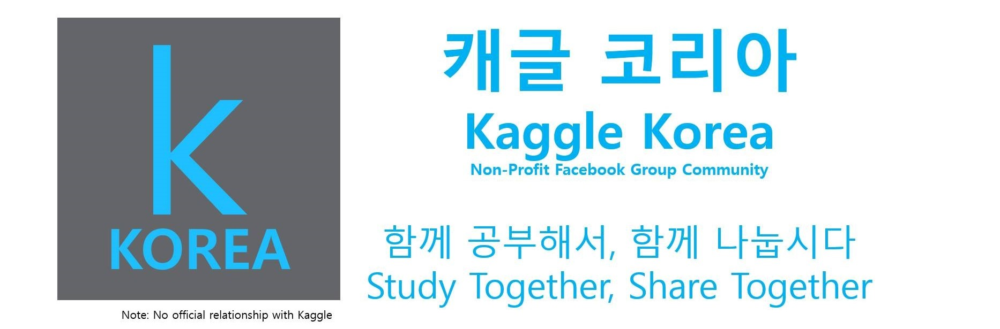

# kaggle

## `캐글 코리아` 공식 창원지역 스터디 그룹

<a href="https://www.facebook.com/groups/KaggleKoreaOpenGroup/"><b>캐글 코리아 페이스북</b></a> 
**Note: No official relationship with `Kaggle`**

## 첫 번째 지역모임(종료)

## 두 번째 지역모임

**참여인원**: <a href="https://github.com/KimJiSeong1994">김지성</a>,
<a href="https://github.com/Imchul">임철</a>,
<a href="">서정훈</a>,
<a href="https://github.com/sun6880">선주은</a>,
<a href="https://github.com/Song-bosun">송보선</a>,
<a href="https://github.com/syj706">신영준</a>

<table style="width: 90%">
  <tr>
    <th>날짜</th>
    <th>설명</th>    
    <th>자료</th>
    <th>비고</th>
  </tr>
  <tr>
    <td>Sep. 30</td>
    <td><b>소개 및 계획</b> 캐글 코리아 지역스터디 및 참여인원 소개</td>
    <td>
      <a href="">강경수</a>
    </td>
    <td align="center">온라인 (행아웃)</td>
  </tr>
  <tr>
    <td>Oct. 7</td>
    <td><b>관심있는 분야 및 데이터셋 정보공유</b> 모임에 참석하시는 분들의 관심분야가 각자 다르기 때문에 관심있는 분야 또는 데이터셋을 조사하여 관심사 공유</td>
    <td>
      <a href="">강경수</a>,
      <a href="">김지성</a>,
      <a href="">임철</a>, 
      <a href="">서정훈</a>,
      <a href="">선주은</a>,
      <a href="">송보선</a>,
      <a href="">신영준</a>
    </td>
    <td align="center">온라인 (행아웃)</td>
  </tr>
  <tr>
    <td>Oct. 14</td>
    <td><b>예정</b> </td>
    <td></td>
    <td align="center">온라인 (행아웃)</td>
  </tr>
</table>
