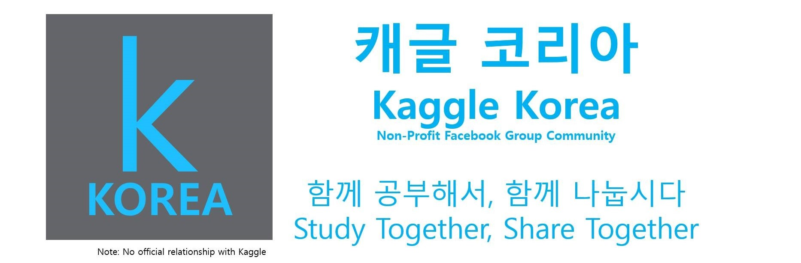

# kaggle-study

## `캐글 코리아` 창원지역 스터디 그룹

### <a href="https://www.facebook.com/groups/KaggleKoreaOpenGroup/"><b>캐글 코리아 페이스북</b></a> 
**Note: No official relationship with `Kaggle`**

### <a href="https://github.com/unerue/kaggle-study/blob/master/kaggle-study/materials/materials.md" target="_blank">볼만한 자료 공유</a>

## 첫 번째 지역모임(종료)

## 두 번째 지역모임

**참여인원**: <a href="https://github.com/KimJiSeong1994">김지성</a>, <a href="">서정훈</a>, <a href="https://github.com/sun6880">선주은</a>, <a href="https://github.com/Song-bosun">송보선</a>, <a href="https://github.com/syj706">신영준</a>, <a href="https://github.com/Imchul">임철</a>

<table>
  <tr>
    <th>날짜</th>
    <th>설명</th>    
    <th>자료</th>
    <th>비고</th>
  </tr>
  <tr>
    <td>Sep. 30</td>
    <td><b>소개 및 계획</b> 캐글 코리아 지역스터디 및 참여인원 소개</td>
    <td>
      <a href="https://github.com/unerue/kaggle-study/blob/master/kaggle-study/2019-09-30/kaggle-orientation.pdf">강경수</a>
    </td>
    <td align="center">온라인 (행아웃)</td>
  </tr>
  <tr>
    <td>Oct. 7</td>
    <td><b>관심있는 분야 및 데이터셋 정보공유</b> 모임에 참석하시는 분들의 관심분야가 각자 다르기 때문에 관심있는 분야 또는 데이터셋을 조사하여 발표</td>
    <td>
      <a href="https://github.com/unerue/kaggle-study/blob/master/kaggle-study/2019-10-07/unerue.pdf">강경수</a>,
      <a href="https://github.com/unerue/kaggle-study/blob/master/kaggle-study/2019-10-07/KimJiSeong1994.key">김지성</a>,
      <a href="https://github.com/unerue/kaggle-study/blob/master/kaggle-study/2019-10-07/sun6880.pptx">선주은</a>, 
      <a href="https://github.com/unerue/kaggle-study/blob/master/kaggle-study/2019-10-07/Song-bosun.pptx">송보선</a>,
      <a href="https://github.com/unerue/kaggle-study/blob/master/kaggle-study/2019-10-07/syj706.pptx">신영준</a>,
      <a href="https://github.com/unerue/kaggle-study/blob/master/kaggle-study/2019-10-07/">임철</a>
    </td>
    <td align="center">온라인 (행아웃)</td>
  </tr>
  <tr>
    <td>Oct. 14</td>
    <td><b>첫 번째 관심 데이터 발표: 데이터 분석</b> 
      <ul>
        <li>강경수: Toxic Comment Classification Challenge</li>
        <li>서정훈: </li>
        <li>선주은: </li>
        <li>송보선: </li>
        <li>신영준: </li>
        <li>임철: </li>
      </ul>
    </td>
    <td></td>
    <td align="center">온라인 (행아웃)</td>
  </tr>
  <tr>
    <td></td>
    <td><b>예정</b> </td>
    <td></td>
    <td align="center">온라인 (행아웃)</td>
  </tr>
</table>
